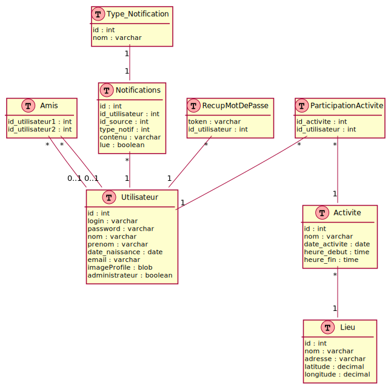

# ProjetDevWeb

## Dépendances

- Java 11+
- Maven 3

## Lancement

Dans un terminal :
```bash
# On clone le dépôt...
git clone https://github.com/thomasbigel/ProjetDevWeb.git -b main
# ...et on se déplace dans sa racine
cd ProjetDevWeb

#On compile le projet
mvn build

# On lance le projet en utilisant tomcat
mvn tomcat7:run
```
## Diagramme de classe de la base de données


